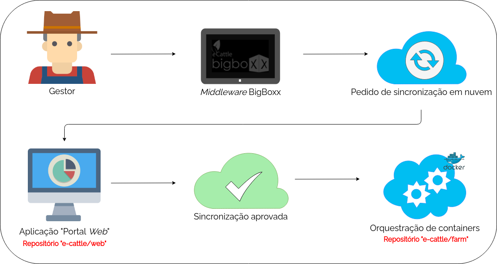

### Conteúdo
- [Sobre](#sobre)
- [Estrutura de arquivos](#estrutura-de-arquivos)
- [Descrição dos elementos](#descrição-dos-elementos)
- [Funcionamento do repositório farm](#funcionamento-do-repositório-farm)
- [Esquemático do repositório farm](#esquemático-do-repositório-farm)


## Sobre

O repositório farm é responsável pelas instâncias das propriedades na nuvem através da utilização de containers [Docker](https://docs.docker.com/) parametrizados.

### Termos comumente utilizados no projeto
- *Job*: Uma tarefa agendada que é realizada a cada X segundos/minutos/dias;
- *Service*: É como uma aplicação rodando em um *container* é chamada;
- *Stack*: É um conjunto de *services*.

## Estrutura de arquivos

```
  farm:dir
  ├ scheduler-job:dir
  └ SchedulerJob.yml:file
```


## Descrição dos elementos

- **farm:dir**: Diretório raiz do repositório contendo código-fonte da aplicação *Scheduler Job* e arquivo *Compose* para criação da *stack* das novas propriedades;
- **scheduler-job:dir**: A aplicação "scheduler-job" verifica quais são as propriedades novas que requerem sincronismo em nuvem, em seguida, cria a *stack* da propriedade rural;
- **SchedulerJob.yml:file**: Arquivo para criação da *stack* SchedulerJob
	- A *stack* SchedulerJob é formada pelos *services*:
		- Aplicação em [NodeJS](https://nodejs.org/en/) intitulada "node-scheduler", reponsável por criar a *stack* de cada farm nova no ambiente *cloud*;
		- Aplicação UI [Agendash](https://github.com/agenda/agendash) para gerenciamento dos "jobs";
		- Cada propriedade terá sua *stack cloud* criada utilizando o *template* "DockerfileNewEnvironmentCloud.yml" e terá os seguintes *services*:
			- Banco de dados não relacional [MongoDB](https://www.mongodb.com/);
			- Aplicação em [NodeJS](https://nodejs.org/en/) utilizando informações do **repositório** **[web](#link-ecattle-github)**;
			- Aplicação [GraphQL](https://graphql.org/) utilizando informações do diretório **graphql**;
			- Aplicação em [NodeJS](https://nodejs.org/en/) utilizando informações do diretório **kernel**;


## Funcionamento do repositório farm

#### Pedido de sincronização

Para que uma propriedade tenha seus dados sincronizados na nuvem, é preciso fazer a requisição através da tela "Sincronização" no *Middleware* BigBoxx, conforme figura abaixo.

<figure>
	
	<figcaption>Figura 1: Pedido de sincronização através do BigBoxx</figcaption>
</figure>


Explicação da Figura 1...


#### Esquemático do repositório farm

Em breve

<!--
O repositório farm é utilizado após o pedido de sincronização na nuvem realizado no BigBoxx local. Assim que a sincronização é aprovada através da  **[Aplicação Gestora](#link-ecattle-github)**, o repositório farm recebe os parâmetros da propriedade necessários para criar sua instância na nuvem. A instância da nuvem consiste na criação de quatro containers, cada um responsável por um módulo do ambiente em nuvem. São eles:
- Container com o Banco de dados [MongoDB](https://www.mongodb.com/), utilizado para persistir os dados da propriedade na nuvem;
- Container com [NodeJS](https://nodejs.org/en/), utilizado para a aplicação "Portal Web" responsável pela disponibilização dos dados sincronizados na nuvem e gerenciamento dos BigBoxx vinculados à propriedade. O código da aplicação encontra-se no **repositório** **[web](#link-ecattle-github)**;
- Container com [GraphQL](https://graphql.org/), utilizado para consulta das informações persistidas, é criado através do diretório **graphql** que replica o **repositório** **[query](https://github.com/e-cattle/query)**;
- Container com [NodeJS](https://nodejs.org/en/), utilizado pelo  **repositório** **[kernel-bigboxx](https://github.com/e-cattle/kernel)**.
-->

- Figuras criadas com [Draw IO](https://app.diagrams.net/)